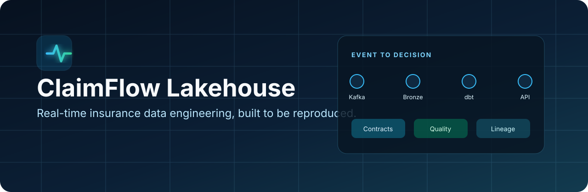
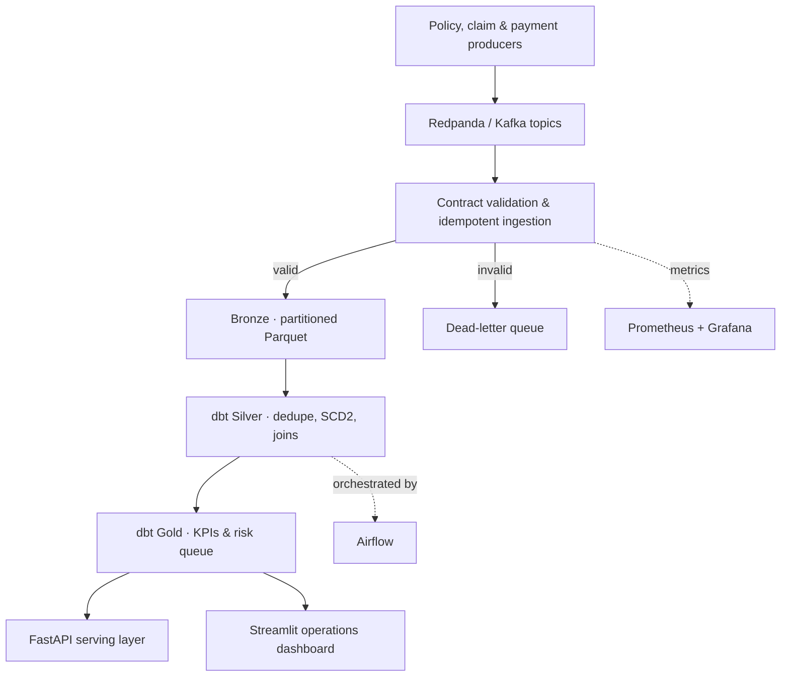
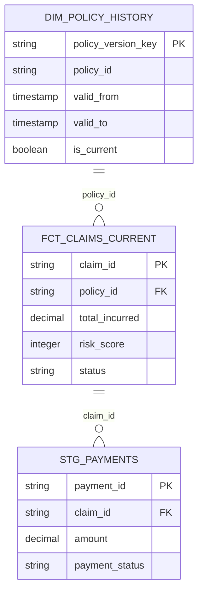

<div align="center">



# ClaimFlow Lakehouse

### Real-time, quality-gated insurance claims data platform


**Streaming ingestion · Data contracts · PII protection · Medallion lakehouse · SCD Type 2 · Data quality · Observability · Analytics API**

</div>

## Why this project exists

Insurance claims arrive from portals, mobile apps, call centers, partner APIs, and legacy systems. Those events are late, duplicated, malformed, and sensitive. ClaimFlow turns that noisy event stream into governed, query-ready data products for operations teams.

This is a working portfolio project, not an architecture-only mockup. The deterministic demo generates source events, validates and tokenizes them, writes partitioned Parquet, builds Silver and Gold models, executes data tests, and serves the result through an API and dashboard.

## Architecture



| Layer | Engineering capability |
|---|---|
| Ingestion | Kafka-compatible topics, keyed events, idempotent producer, consumer groups, manual offset commits |
| Governance | Versioned Pydantic/JSON contracts, dead-letter queue, HMAC-based PII tokenization |
| Bronze | Zstandard-compressed Parquet partitioned by entity and event date; replay ledger |
| Silver | Event deduplication, current claim fact, Type 2 policy history, referential joins |
| Gold | Operational KPIs, daily claim metrics, explainable high-risk work queue |
| Reliability | dbt tests, quality SLOs, bounded backfills, deterministic synthetic data, CI |
| Serving | Read-only FastAPI endpoints and interactive Streamlit dashboard |
| Observability | Prometheus counters/histograms and a provisioned Grafana dashboard |

## Run it in GitHub Codespaces

No local installation is required.

1. Create a GitHub repository and upload this project.
2. Select **Code → Codespaces → Create codespace on main**.
3. Wait for the automatic dependency installation to finish.
4. Run:

```bash
make demo
make dashboard
```

Open the forwarded port **8501** to view the dashboard. The demo uses 5,000 deterministic events and applies 1% fault injection to eligible claim and payment events to exercise the quarantine path.

### Verified demo result

| Measure | Result |
|---|---:|
| Source events | 5,000 |
| Accepted into Bronze | 4,963 |
| Deliberately invalid events quarantined | 37 |
| Current claims produced | 1,993 |
| dbt models built | 9 |
| dbt data tests passed | 15/15 |
| Project quality SLOs passed | 4/4 |

These values are deterministic for the default seed. They show correctness and reproducibility, not a distributed-throughput benchmark.

To open the API instead:

```bash
make api
```

Then use the forwarded port **8000/docs** for the interactive OpenAPI interface.

## Use the streaming path

Start Redpanda and its topic console:

```bash
make kafka-up
```

In separate terminals, start the consumer and publish events:

```bash
claimflow ingest-kafka --bootstrap-servers localhost:9092
claimflow publish-kafka --events 5000 --bootstrap-servers localhost:9092
```

Redpanda Console is available on port **8080**. Build the curated tables after ingestion with `make transform`.

For the complete containerized application and observability services:

```bash
docker compose --profile streaming --profile apps --profile observability up --build
```

## Data model



## Reliability behavior

- **Duplicates:** an on-disk event ledger skips events already acknowledged. Every staging model also deduplicates by `event_id`, covering a crash between Parquet write and ledger acknowledgement.
- **Bad events:** contract failures are written to `data/dlq/invalid-events.ndjson` with the reason and original record.
- **Sensitive data:** names and email addresses never enter Bronze in clear text; stable keyed tokens preserve joinability.
- **Late data:** transformations use event time, and the backfill utility replays a bounded time window safely.
- **Quality gates:** CI runs code tests, the end-to-end data build, dbt relationship/uniqueness/value tests, and the project quality SLOs.

## Useful commands

| Command | Purpose |
|---|---|
| `make demo` | Reset generated data and run the full local event-to-Gold workflow |
| `make test` | Run Python unit tests with coverage |
| `make lint` | Run Ruff static checks |
| `make transform` | Build and test dbt models |
| `make dashboard` | Start the operations dashboard |
| `make api` | Start the analytics API |
| `python -m claimflow.quality` | Evaluate quality SLOs and write a JSON report |
| `python -m claimflow.backfill …` | Replay an event-time range idempotently |

## Repository map

```text
src/claimflow/       ingestion, contracts, security, API, dashboard
transform/           dbt staging, core, marts, and data tests
orchestration/dags/  Airflow DAG
contracts/           portable JSON event contract
monitoring/          Prometheus and Grafana configuration
tests/               unit and component tests
docs/                design decisions, runbook, and portfolio material
.devcontainer/       one-click Codespaces environment
```

## Design trade-offs

The demo uses DuckDB and local Parquet so reviewers can reproduce it at zero cloud cost. The boundaries are intentionally portable: Kafka topics can map to MSK/Event Hubs, Parquet to S3/ADLS, DuckDB to Databricks/Snowflake/BigQuery, and Airflow to MWAA/Cloud Composer. See [cloud mapping](docs/cloud-mapping.md) and [architecture decisions](docs/architecture-decisions.md).

## Portfolio material

- [LinkedIn launch post](docs/linkedin-post.md)
- [Recruiter and interview talking points](docs/interview-guide.md)
- [Production incident runbook](docs/runbook.md)
- [Cloud deployment mapping](docs/cloud-mapping.md)

All data is synthetic. No real customer, policyholder, or claim information is included.
